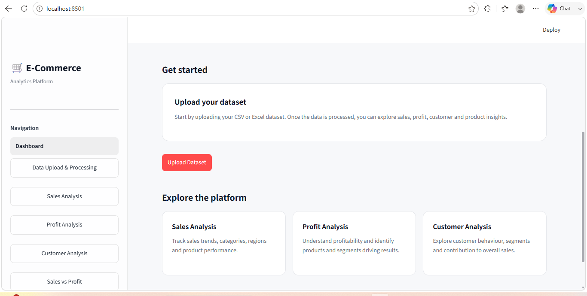
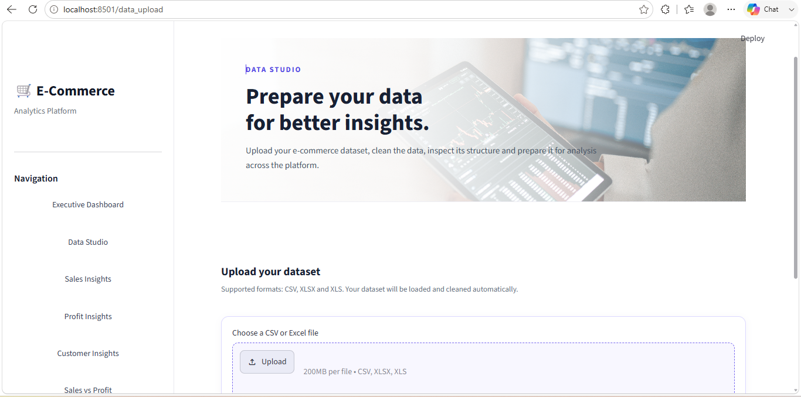
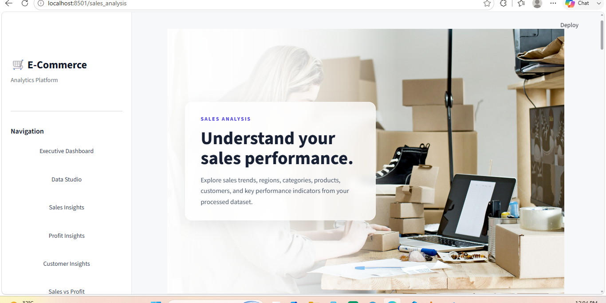
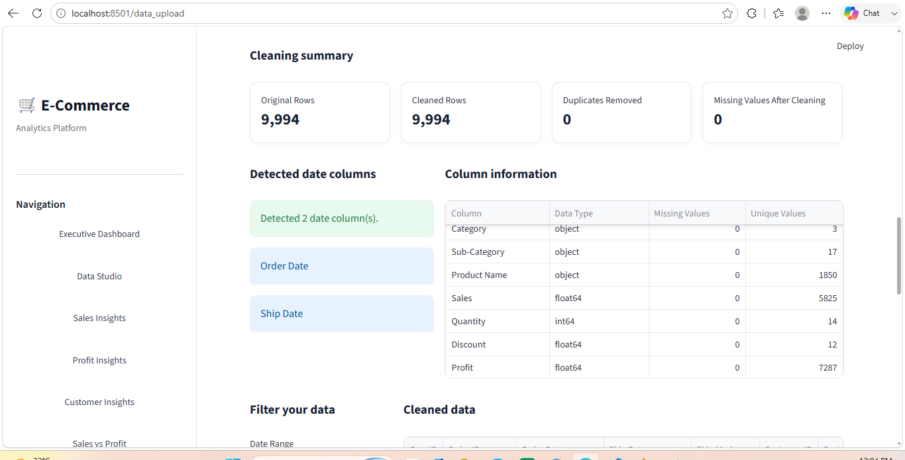
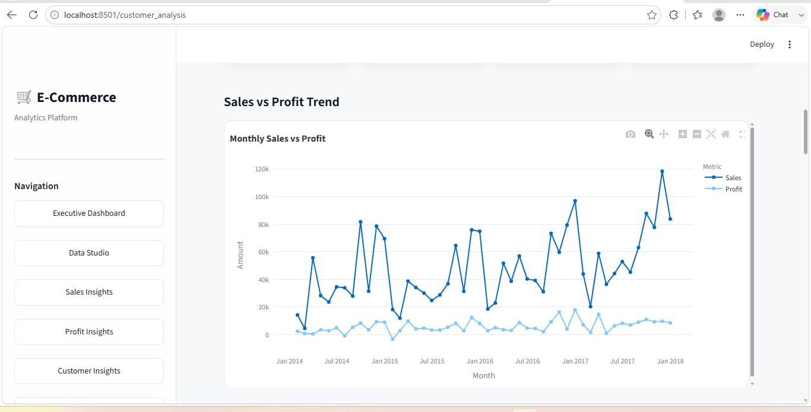

#  E-Commerce Analytics Platform

An interactive **E-Commerce Analytics Platform** built with Python and Streamlit to analyze sales, profit, customers, products, and overall business performance.

The application allows users to upload e-commerce datasets, clean and explore the data, apply dynamic filters, and generate interactive visualizations for business insights.

---

## Features

###  Data Upload & Cleaning
- Upload **CSV, XLSX, and XLS** files
- Automatic data loading and preprocessing
- Date column detection and conversion
- Data cleaning and validation
- Preview uploaded datasets
- Download processed data

### Sales Analysis
- Total sales analysis
- Sales trends over time
- Regional sales performance
- Category and sub-category analysis
- Sales by customer segment
- Product-level sales analysis
- Interactive Plotly visualizations

###  Profit Analysis
- Total profit analysis
- Profit trends over time
- Profit by region
- Profit by category and sub-category
- Customer segment profitability
- Product-level profit analysis
- Profit margin analysis

###  Customer Analysis
- Customer-level analysis
- Customer segmentation
- Customer purchase behavior
- Sales and profit contribution by customer

###  Sales vs Profit Analysis
- Compare sales and profit across business dimensions
- Sales vs profit trends
- Category performance comparison
- Regional performance comparison
- Segment performance comparison
- Product-level sales vs profit relationship

###  Data Explorer
- Explore the uploaded dataset
- Filter and inspect records
- View selected columns
- Download filtered data

---
##  Dashboard Preview












##  Tech Stack

 **Python** 
 **Streamlit** 
 **Pandas** 
 **NumPy** 
 **Plotly** 
 **OpenPyXL** 
 **xlrd** 

---

##  Project Structure

```text
E-Commerce-Analytics-Platform/
│
├── app.py
├── requirements.txt
├── README.md
├── .gitignore
│
├── pages/
│   ├── data_upload.py
│   ├── sales_analysis.py
│   ├── profit_analysis.py
│   ├── customer_analysis.py
│   ├── sales_vs_profit.py
│   ├── data_explorer.py
│   │
│   └── Data/
│       └── navigation.py
│
├── assets/
│   ├── data_upload.jpg
│   ├── sales_analysis.jpg
│   └── ...
│
└── sample_data/
    └── E-Commerce_Sales_Sample.csv
